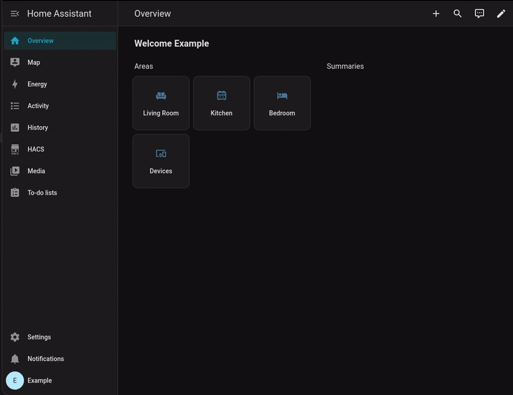
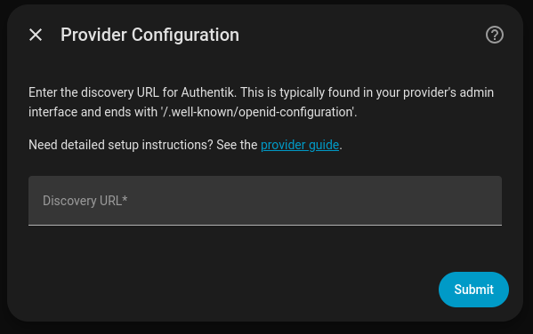
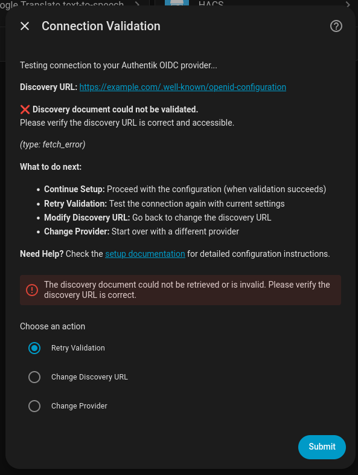
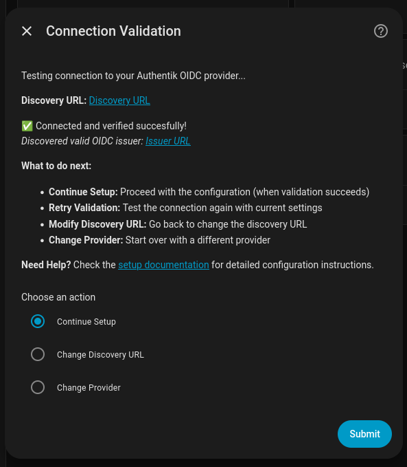
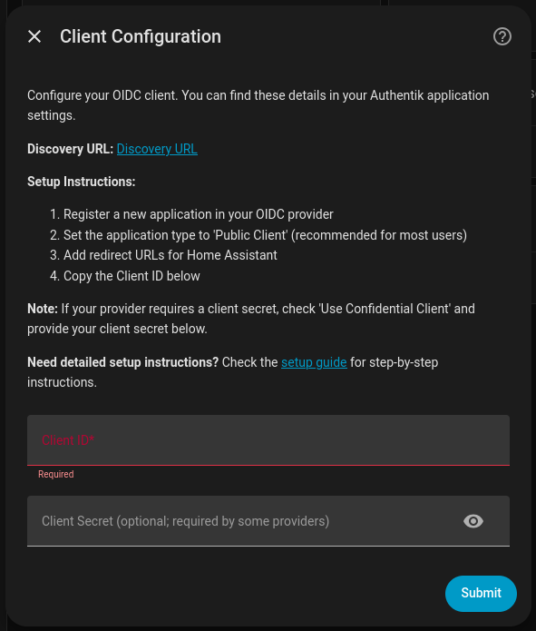
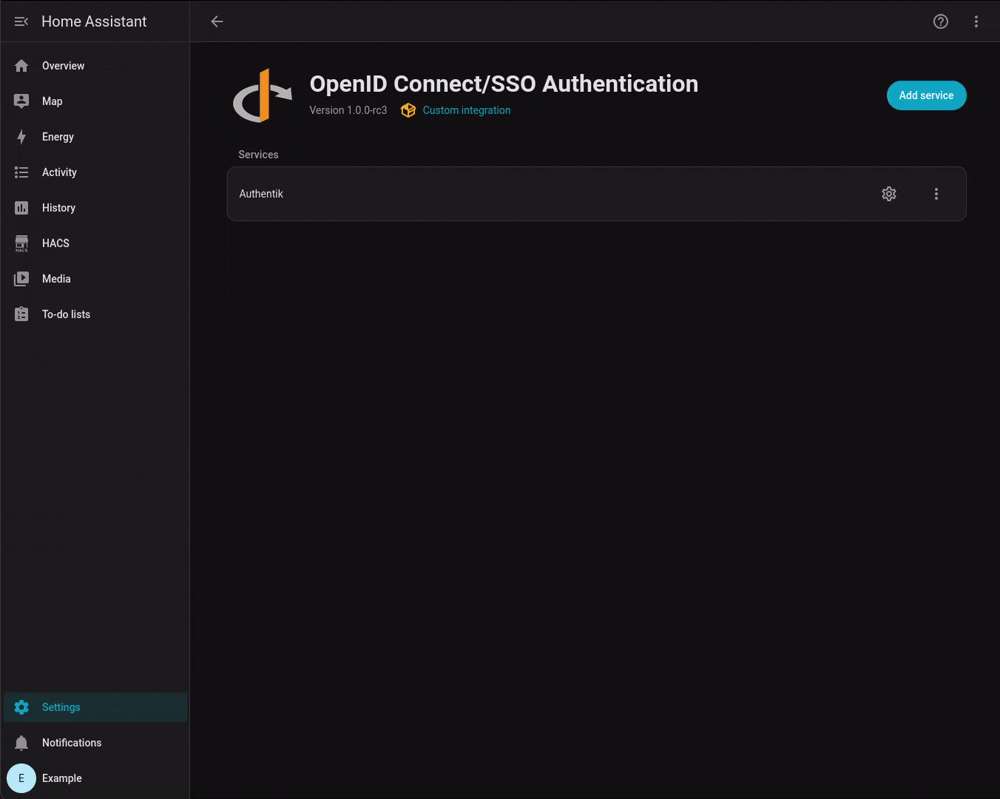

# authentik

> [!TIP]
> This guide describes configuring authentik using the UI method. You can also configure authentik by hand with YAML. Instructions for configuring any provider using YAML can be found here: [YAML Configuration Guide](../configuration.md).

## Step 1. Install the integration

Make sure that you have fully installed the latest release of the integration. The easiest way to install the integration is through [the Home Assistant Community Store (HACS)](https://hacs.xyz/). You can find usage instructions for HACS here: https://hacs.xyz/docs/use/.

After installing HACS, search for "OpenID Connect" in the HACS search box or click the button below:

## Step 2. Configure authentik

1. Log in to authentik as an administrator and open the authentik Admin interface.

2. Navigate to **Applications > Applications** and click **Create with Provider** to create an application and provider pair. (Alternatively you can first create a provider separately, then create the application and connect it with the provider.)

 -   **Application**: provide a descriptive name, an optional group for the type of application, the policy engine mode, and optional UI settings.
 -   Choose a **Provider Type**: select **OAuth2/OpenID Connect** as the provider type.
 -   **Configure the Provider**: provide a name (or accept the auto-provided name), the authorization flow to use for this provider, and the following required configurations.
        - Note the **Client ID**, **Client Secret**, and **slug** values because they will be required later.
        - Set a `Strict` redirect URI to `https://<your HA URL>/auth/oidc/callback`.
        - Select any available signing key (to use the RS256 `id_token_signing_alg`)
  -  Configure Bindings (optional): you can create a binding (policy, group, or user) to manage the listing and access to applications on a user's **My applications** page.

## Step 3. Home Assistant configuration

The recommended setup method for beginners is through the "Integrations" panel within the Home Assistant UI. You can also use YAML setup, for which you can find the configuration guide here: [YAML Configuration Guide](../configuration.md).

1. Open Home Assistant and go to **Settings -> Devices & Services**.
2. Click Add Integration and select **OpenID Connect/SSO Authentication**.

3. Now click "Authentik" and continue to the next screen
4. Set the discovery URL to `https://<your Authentik URL>/application/o/<application_slug>/.well-known/openid-configuration` using the **slug** from the earlier authentik configuration step and click **Submit**

5. Your URL will be tested. You may see an error, such as the picture below. Check your URL and verify that Home Assistant can access your authentik installation. Change the URL or retry.

6. If your discovery URL is tested succesfully, you will see something like this and you can continue with the **Submit** button to continue.

7. You will then be prompted to fill in the client details, the **Client ID** and the **Client Secret** (if you used the Public Client type in authentik, there is no Client Secret required). Paste them in the relevant input boxes and continue setup with **Submit**.

8. You will then be asked about **Groups & Role Configuration** and **User Linking**. Configure these options as you wish or leave the defaults in place. You can also change these settings later by opening the integration settings and clicking the reconfiguration icon.

## Done!

You should now automatically see the welcome screen upon opening your Home Assistant URL. On the welcome screen you can choose to either start login through SSO or to use an alternative login method, which will bring you back to the normal Home Assistant username/password login screen.