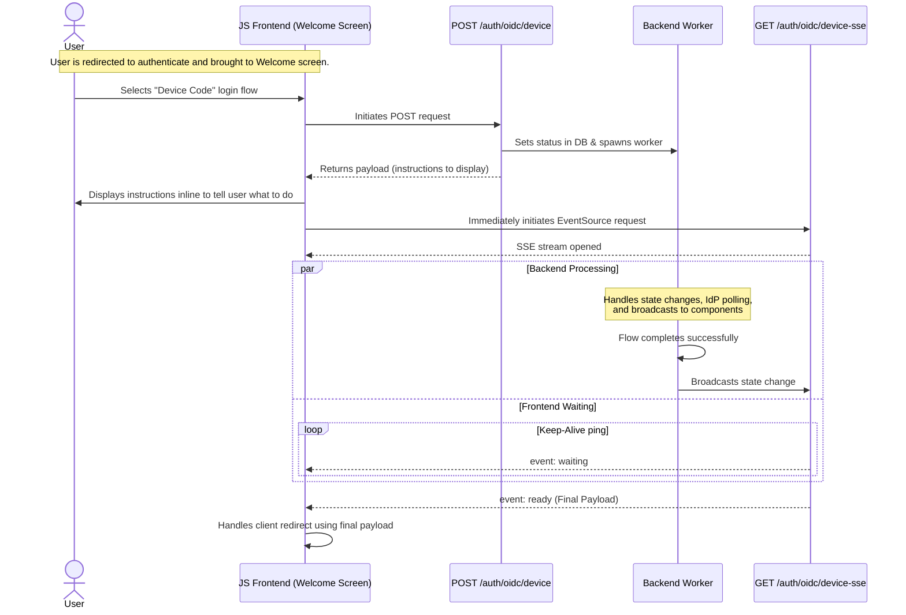

This is a draft PR to refactor the existing device code functionality to enable support for external IdP device code flows. This PR is focused on setting the backend foundation—including endpoint restructuring and internal state management—for the device auth flow. While highly specialized frontend routing logic will be deferred to later PRs, this PR establishes the bedrock: cleanly separating normal OAuth/OIDC flows from device code flows. 

Specifically, this PR introduces new `/auth/oidc/*` endpoints to handle the device code fallback locally (in case the IdP does not support device codes) and establishes a decoupled Server-Sent Events (SSE) pattern. By using SSE, our custom JS frontend on the Welcome Screen can seamlessly listen for backend state changes while an abstracted backend worker handles the actual polling of the IdP (e.g., Authentik). Standard HTTP polling of the device endpoint is also supported as a fallback to future-proof for third-party clients.

> [!NOTE]
> This PR will not address discussion #350 at this time and will be followed up in a separate PR.

## Proposed endpoints:

- `/auth/oidc/device` (GET): Endpoint that the user is directed to on a secondary device to enter the activation code (fallback for when IdP device code flow is unavailable). This requires the user to get authorized through the normal OAuth/OIDC flow first.
- `/auth/oidc/device` (POST): Endpoint for the client to explicitly initiate the device code flow after UX routing logic completes. This triggers the backend to begin background polling with the IdP and provides the client with a session token cookie. The client may also use this endpoint to poll for the status of the device code flow in line to the OIDC standard for device code flows. However, SSE is the preferred method for clients that are running the front end code provided by this integration.
- `/auth/oidc/device-sse` (GET): Endpoint the client connects to for Server-Sent Events (SSE) after initiation. The backend matches the request based on the session token cookie provided by the initiation POST request. A direct request to this endpoint without the device flow being initiated will be rejected.
- `/auth/oidc/redirect`: Remains functionally the same, except that it is explicitly chosen by the frontend UX logic. The backend remains agnostic to the flow type; it relies on the frontend to route accordingly based on device detection or user input.

## PR Context

This PR is supposed to address issue #300 and move discussion from #349 to this PR. Furthermore, this proposal is preliminary and will be updated as I further research the codebase.

## Decoupled Device Flow Diagram

The following sequence diagram illustrates how the frontend SSE connection is decoupled from the actual background polling task (which handles either the external IdP device flow or the internal fallback flow).

